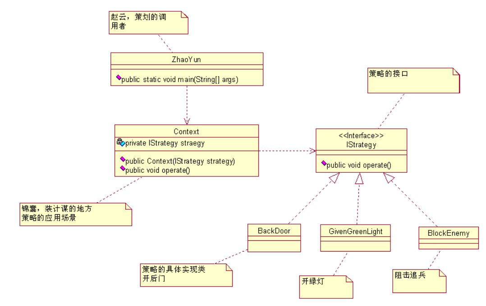

# 策略模式 Strategy Pattern

刘备要到江东取老婆了，走之前诸葛亮给赵云（伴郎）三级锦囊妙计，说是按天机岔开解决棘手问题，嘿，还别说，这是解决了大问题，搞到最后周瑜赔了夫人又折兵呀。

先说这个场景中的要素：三个妙计，一个锦囊，一个赵云，妙计是小亮同志给的，妙计是放置在锦囊里，俗称就是锦囊妙计嘛，那赵云就是一个干活的人，从锦囊中取出妙计，执行，然后获胜，用 Java 程序怎么表现这个呢？

三个妙计是同一类型的东东

赵云实际不知道那个策略呀，他只知道拆抵押给锦囊，而不知道是 BackDoor这个妙计，咋办？似乎这个策略模式已经把计谋名称写出来了

错！BackDorr, GivenGreenLight, BlockEnemy 只是一个代码，写成 First, Sencond, Third，没人会说你错！

策略模式好处就是：体现了高内聚低耦合的特性；还有课扩展性，也就是 OCP 原则，策略类可以继续增加下去，只要修改 Context.java 就可以了
