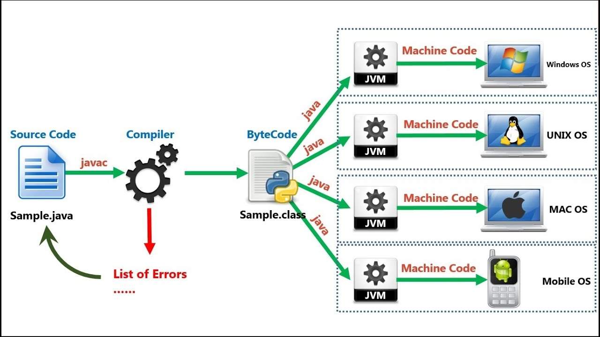

# Java SE

## 软件开发

- 软件：按照特定顺序组织的计算机数据和指令的集合
- 开发：软件的制作过程
- 软件开发：借助开发工具与计算机语言制作软件

## 计算机语言

> 人与计算机之间进行信息交流沟通的一种特殊语言

- 机器语言：用二进制代码指令表达的计算机语言，指令是用0和1组成的一串代码
- 汇编语言：使用一些特殊的符号来代替机器语言的二进制码，计算机不能直接识别，需要用一种软件将汇编语言翻译成及其语言
- 高级语言：使用普通英语进行编写源代码，通过编译器将源代码翻译成计算机直接识别的机器语言，之后再由计算机执行
  - 高级语言：C/C++, C#, Java, Go

## 人机交互

- CLI：命令行界面，需要有一个控制台，输入特定的指令，让计算机完成一些操作
- GUI：图形用户界面，鼠标和触摸屏容易上手操作
  - 早期思乐公司(企业内部开发) -> 乔布斯知道了(用股票诱惑思乐公司老板) -> Jobs 研究GUI -> 炫耀GUI -> 比尔盖茨知道了并事先发布了

## 键盘功能键介绍

- tab: 制表符
- shift: 上档转换键
- Ctrl: 控制键
- Alt: Alter改变
- 空格
- Enter 回车键
- Windows
- PrtSc(PrintScreen)屏幕截图

### 快捷键

- Win + d 快速桌面
- Win + e 我的电脑
- Win + l 切换用户
- Win + r 运行命令

- d: 回车 盘符切换
- dir 列出当前目录下的文件以及文件夹
- md 创建目录
- rd 删除目录
- cd 切换目录
- cd .。 退回到上一级目录
- cd \ 退回到根目录
- del 删除文件
- exit 退出命令
- cls 请屏幕

## Java 简介

### What is Java

> 由 SUN 公司 James Gosling 开发推出的，后被 Oracle 公司74亿美金 收购

### Java 种类

- Java SE: Java Standard Edition (标准版) 开发普通左面和商务应用程序提供的解决方案
- Java EE: Java Enterpice Edition (企业级开发) 开发电子消费产品和嵌入式设备提供的解决方案
- Java ME: Java Micro Edition (微型版开发) 开发企业环境下的应用程序提供一套解决方案

### Java 开发工具

- JDK: Java Development Kit (Java 开发工具包，包含 JRE) 编译(javac.exe)、运行(java.exe)、打包(jar.exe)和文档生成(javadoc.exe)等工具
- JRE: Java Runtime Enviroment (Java 执行环境) 只能执行编译后的字节码

### Java 版本

- JDK 1.4
- JDK 1.5(5.0) 代号为"Tiger" 老虎
- JDK 1.6(6.0) 代号的"Mustang" 野马
- JDK 1.7(7.0) 代号的"Dolphin" 海豚

- jdk-7u72-windows-i586.exe
  - u: update
  - i586: 32位
  - x64: 64位

### Java发展的时间表

- 版本号 名称 中文名 发布日期）
- JDK 1.1.4 Sparkler 宝石 1997-09-12
- JDK 1.1.5 Pumpkin 南瓜 1997-12-13
- JDK 1.1.6 Abigail 阿比盖尔--女子名 1998-04-24
- JDK 1.1.7 Brutus 布鲁图--古罗马政治家和将军 1998-09-28
- JDK 1.1.8 Chelsea 切尔西--城市名 1999-04-08
- J2SE 1.2 Playground 运动场 1998-12-04
- J2SE 1.2.1 none 无 1999-03-30
- J2SE 1.2.2 Cricket 蟋蟀 1999-07-08
- J2SE 1.3 Kestrel 美洲红隼 2000-05-08
- J2SE 1.3.1 Ladybird 瓢虫 2001-05-17
- Java SE 1.4.0 Merlin 灰背隼 2002-02-13
- Java 1.4.1 grasshopper 蚱蜢 2002-09-16
- Java 1.4.2 Mantis 螳螂 2003-06-26
- Java 5.0 (1.5.0) Tiger 老虎 2004-10
- Java 6.0 (Beta) Mustang 野马 2006-04
- Oracle 公司宣布收购 Sun 2009年
- 2011年，Oracle 公司发布 Java7 正式版
- 2014年，Oracle 公司发布了 Java8 正式版

### Java语言特定

- 简单性
- 解释性
- 高性能
- 多线程
- 动态
- 安全性
- 面向对象
- 分布式处理
- 健壮性
- 结构中立
- **开源**
- **跨平台**
  - write once, run anywhere 一处编译，到处运行
  - what: 不同的系统平台上都可以运行
  - 原理：在Java虚拟机上运行java应用程序，由JVM来负责Java程序在该系统中的运行



### 下载安装 JDK

1. 下载 JDK
2. 安装 JDK
3. 设定环境变量（用户变量或系统变量）指向 JDK 安装目录中的 bin 目录
4. 通过运行，输入 cmd 打开命令行窗口，输入 java --version，显示出 java 版本信息

### Java 程序的执行过程

1. javac 编译成字节码文件
2. java 执行字节码

- Class 文件是**字节码**文件，程序最终执行的就是这个字节码（bytecode）文件。
- 编译命令：`java Test.java`
- 执行命令：`java Test`（注意，Test后面没有.class）

### Java 跨平台(OS)语言

- Java 是跨平台的语言，真正执行的不是二进制代码，而是字节码
- JVM（Java Virtual Machine，Java 虚拟机, C 语言实现的）
- Java 是跨平台的，而**JVM**不是跨平台的（JVM 是由 **C 语言**编写的）
- Java 之所以能够做到跨平台，本质原因在于 JVM 不是跨平台的

### 开发工具

- Windows: notepad, editplus,ultraedit, gvim
- Linux: vi, vim, gedit

## Java Data type

### Primitive Data Type 原生数据类型

- Boolean
- Integer(整型)
- Float
- Character

### Reference Type 引用类型(对象类型)

- Array
- Class
- Interface

### 变量与常量

- 常量：值不会变化的量
- 变量：值可以变化的量

### 如何定义变量？

`变量类型 变量名;`

定义整型变量: `int a;`

### 如何为变量赋值

`变量名 = 变量值;`

`=`表示赋值，将等号右边的值赋给了左边的变量。

Java 中使用 `==` 表示相等，等价于数学中的 `=`

### 变量定义域赋值

`变量类型 变量名;`

`变量名 = 变量值;`

``` java
int a;
a = 1;
```

变量定义域赋值可以合并

变量类型 变量名 = 变量值;

`int a = 1;`

### 变量命名规则

变量名以下划线，字母，$符号开头，且后跟下划线，字母，$符号以及数字

## Primitive Data Type

1. 整型，使用 **int** 表示
2. 字节型：使用 **byte** 表示。数字范围：-128 ~ 127 之间的 256 个整数
3. 短整型：使用 **short** 表示。数字范围：16 bit
4. 长整型：使用 **long** 表示。数字范围：64 bit
5. 单精度浮点型：使用 **float** 表示。所谓浮点型就是小数，也叫实数
6. 双精度浮点型，使用 **double** 表示。双精度浮点型标识的数据范围要比单精度浮点型大。
7. 字符型：使用 **char**(Character) 表示。所谓字符就是单个的字符表示。比如：字母 `a` 或者中文`张`,必须使用单引号包围上。比如：`char a = 'a'; char b = '章';`
8. 布尔类型，使用 `boolean` 表示。布尔类型只有两种可能值，分别是 `true` 和 `false`。

- Java 中所有浮点类型默认都是 `double`
- Java 中所有整型类型默认都是 `int`

### 注释

- 单行注释：`//`开头
- 多行注释：`/*` 开头，以`*/`结束。来源于 C/C++
- 文档注释：`/**` 开头 以`*/`结束。用于产生 Java Doc 帮助文档

Java 中的所有浮点类型默认都是 double 类型。不能将 double 类型的值赋值给 float 类型的变量。即便其 double 类型的值处于 float 类型的范围内也是不可以。能否成功赋值屈居于等号右边的值类型与等号右边的值类型与等号左边的变量类型是否一致。

如何将 double 类型的值付给 float 类型的变量？解决方案：强制类型转换，将 double 类型强制转换为 float 类型。

强制类型转换语法：`类型A 变量名 = (类型A) 类型B的变量值;`

``` java
Java 语言的支持
`float f = 1.2F;` 1.2 声明为 float 类型
1.2f 或 1.2F 都可以使用
```

变量使用前必须先赋值。变量必须要声明其类型方可使用；变量在使用前必须要定义并且只能定义一次

如下代码无法通过编译

``` java
int a = 1;
short b = a;
```

 原因：a 是 int 类型，b 是 short 类型，int 类型表示的数据范围比 short 类型大，不能将表示范围大的值赋给表示范围小的变量

如下代码可以通过编译

``` java
short a = 1;
int b = 1;
```

a 是 short 类型，b 是 in 类型，int 类型表示范围要比 short 类型大，可以讲表示范围小的值赋给表示范围大的变量

总结：可以将表示数据范围小的值赋给表示范围大的变量，但不能直接将表示范围大的值赋给表示范围小的变量，只能通过强制类型转换实现。

## 标识符

- 字母52字符([a-zA-Z])，数字([0-9])，下划线(_)和美元符号($)
- 不能数字开头，不能使用关键字
- 类名：首字母大写，第二个单词首字母大写
- 方法名：首字母小写，每个单词首字母大写

## 进制之间的转换

## Java 基本数据类型

### 引用数据类型： Scanner

> Scanner 类可以命令行中接受键盘输入

```java
import java.util.Scanner;

Scanner s = new Scaner(System.in);
int i = s.nextInt();
String s = s.next();

```

### 引用数据类型 Random

> 随机数：伪随机数，虚拟机根据人写好的一个算法，生成出来的

``` java
import java.util.Random;
Random r = new Random();
int i = r.nextInt(100); // 0-99 之间的随机数
int j = r.nextInt(100) + 1; // 1-99
double d = r.nextDouble(); //  浮点型随机数 0-1 之间的随机数
```

## 流程控制语句(Flow Control Statement)

``` java
// expression
// JDK 1.0 - 1.4 : byte | short | int | char
// JDK 1.5 : byte | short | int | char | enum
// JDK 1.7 : byte | short | int | char | enum | String
swicth(expression) {
  case CONSTANT_1:
    statement;
    break;
  case CONSTANT_2:
    statement;
    break;
  default:
    statement;
    break;
}
// case 后面常量，和 switch 中数据类型相同，没有 break，一直向下穿透
// case 后面没有 break, 程序就会一直向下穿透

for: 变量; 条件; 增量|减量; 循环体
```

## 数组(Array)

> 相同类型数据的集合

### 定义数组

``` java
1. 数据类型[] 数组名 = new 数组类型[元素个数或数组长度];
int a[] = new int[88];
int[] a = new int[88];
```

- 数据类型：数组中存储元素的数据类型
- [] 表示数组的意思
- 变量名 自定义标识符
- 元素个数，数组中存储多少数据（恒定，定长）

`int[] x = new int[100];`

- 数组是一个容器：存储到数组中的每个元素，都有自己的自动编号（最小值是0，最大值是元素个数-1）
- 自动编号称为为，索引（index），下标，角标
- 访问数组存储的元素，必须依赖于索引，公式 数组名[索引]
- Java 提供了数组的属性，操作索引的
- 数组的一个属性，就是数组的长度，属性的名字 length
- 使用属性：`数组名.length`
- 数组的最小索引是0，最大索引是`数组.length - 1`

``` Java
2. 静态初始化数组
数组类型[] 变量名 = new  数据类型[]{ele1，ele2, ...}
注意事项：new 后面的方括号中，不允许写任何内容，写了就编译失败。为什么？实际写的元素个数超过指定长度会抛出异常
数组类型[] 变量名 = new 数据类型[这里不能写任何内容]{ele1，ele2, ...}
```

``` Java
3. 数组定义简写方式
数据类型[] 变量名 = {ele1, ele2, ...};
```

每个数组都有一个名位length长度，表示数组的长度。length属性是 public, final, int的。数组长度一旦确定，就不能改变大小，即只读的

int[] a = new int[10]; 其中a是一个引用，指向了生成的数组对象的首地址，数组中每个元素都是int类型，其中仅存放数据值本身

### 面试题: 数据交换

``` java
x = x ^ y
y = x ^ y
x = x ^ y

x=1=001
y=2=010
x = x ^ y = 001 ^ 010 = 011 = 3
y = x ^ y = 011 ^ 010 = 001 = 1
x = x ^ y = 011 ^ 001 = 010 = 2

12 << 1 = 12 * 2^1 = 24
12 << 2 = 12 * 2^2 = 48

12 >> 1 = 12 / 2^1 = 6
12 >> 2 = 12 / 2^2 = 3
12 >> 3 = 12 / 2^3 = 12 / 8 = 1
```

### JVM 内存划分

- 寄存器：内存和CPU之间
- 本地方法栈：JVM调用了系统中的功能
- 方法和数据共享：运行时期 class 文件进入的地方
- 方法栈：所有的方法运行的时候，进入的内存
- 堆：存储的容器和对象

### 遍历数组

> 通过索引的方式，讲数组中的每个元素分别获取出来

### 数组异常

- 数组的索引越界异常:`java.lang.ArrayIndexOutOfBoundsException`
  - 编译通过，解释执行会抛出异常
- 空指针异常: `java.lang.NullPointerException`

``` java
int[] arr = {5,2,1};
System.out.println(arrp3[]);
'Exception in thread "main" java.lang.ArrayIndexOutOfBoundsException: 3
at ArrayException.main(ArrayException.java:4)'

// 空指针异常
int[] arr = null;
System.out.println(arr[2]);
'Exception in thread "main" java.lang.NullPointerException
        at ArrayException.main(ArrayException.java:8)'
```

### 二维数组定义

``` java
// 1. 第一种定义方式
int[][] arr = new int[3][4];

// 2. 第二种定义方式
int[][] arr = new int[3][];

// 3. 第三种定义方式
int[][] arr = {{1,2}, {3,4,5,6},{7,8,9}};

```

## 方法

调用方法会在方法栈里入栈，方法返回之后出栈

## 理解面向对象称设计的概念

Object Oriented Programming, OOP

Object Oriented Design, OOD

类：抽象的概念，类中包含了数据和数据(名词来表示)的操纵（动词来表示）

对象：一宗具体的概念，是类的一种具体表现方式

数据：在类中称作属性(Property or Attrbiute)或成员变量(Member variable)

方法：对数据的操纵，在类中称作方法(Method)

## 理解面向对象的三大基本特征：Inheritence、Encapsulation and Polymorphism

### Encapsulation

类包含了数据和方法。将数据和方法放在一个类中就构成了封装。

### 如何定义类

``` java
修饰符 class 类名{
  // 类的内容（包含属性和方法）
}
```

### 如何定义方法

``` java
修饰符 返回类型 方法名([参数1, 参数2, ...]) {
  // 方法提
}
```

main 方法是整个 java 程序的入口点。如果一个类中没有 main 方法，该程序是无法运行的。

方法不能嵌套

方法只能定义在类中

关于方法的执行：首先定义方法，接下来就可以使用方法（调用方法），当方法调用完毕后，方法可以返回值。方法到底是否返回值是由方法的定义决定的。

### 如何生成对象

通过类来生成对象（通常使用 new 关键字来生成对象）

类名 变量名 = new 类名();

方法调用需要通过对象来完成

方法调用的形式是：对象变量.方法名([参数1, 参数2, 参数n]);

### 关于方法的注意事项：

方法的定义中，返回的返回值类型与 return 后面的变量或常量类型保持一致。

方法调用时，方法传递的参数需要和方法定义的参数保持一致（参数个数一致，参数类型一致）

方法发定义时的返回类型与接受方法返回值的变量类型保持一致

方法定义的参数叫做形式参数

方法调用时所赋予的具体值叫做实际参数

关键字 void 表示方法不返回值

方法定义中可以有两种情况不返回值

1. 不使用 return 语句
2. 使用 return。但 return 后面没有任何值或变量。return 后面只有一个分好，表示退出方法，返回到方法的调用端。`return;`

类中的属性又叫做成员变量（member variable），属性用英语表示为property 或者  attribute

对象(object)又叫做实例(instance)。生成一个对象过程又叫做实例化。

### 命名约定

- 类，首字母大写，多个单词组成的类名每个单词首字母都大些

- 方法，首字母大写，多个单词组成的方法，第一个单词首字母小写，其他的单词的首字母大写

- 属性，命名约定与方法相同

属性定义在类中，又叫做成员变量；而定义在方法中的变量叫做局部变量。

如何定义属性？

··· java
public class Person {
  修饰符 类型 属性名称;
}
···

如何使用属性？与方法一样，使用 .运算符。首先生成类的实例，然后使用实例+"."的方式来使用属性。

``` java
Person p = new Person();
p.age
```

局部变量使用前必须要声明并赋初值；成员变量使用前必须要声明，但可以不赋初值；

成员变量与局部变量的联系与区别？

1. 无论是成员变量还局部变量，使用前必须声明(定义)
2. 局部变量，使用前必须要初始化；成员变量，使用前可以不初始化。如果没有初始化成员变量就开始使用，那么每个类型的成员变量都有一个默认的初始值。

- `byte, short, int, long` 类型的初始值为 `0`
  - byte 与 {byte|short|char} 进行运算的自动提升为 int
  - b1 和 b2 是两个变量，变啊另存储的值是变化，在编译的时候无法判断里面具体的值，相加有可能会超出 byte 的数值
- `float, double` 类型的初始化值为 `0.0`

- `char` 类型的初始值为 `'\u0000'`

- `boolean` 类型的初始值为 `false`

引用类型(reference type)是用在对象行上的。一个对象可以被多个引用所指向，但同一时刻，每个引用只能指向唯一的一个对象。如果一个对象被多个引用所指向，那么无论哪个引用对对象的属性进行了修改，都会反映到其他的引用当中。

一个类中包含了属性与方法，那么该类的每一个对象都具有自己的属性，但无论一个类共有多少个对象。这些对象共享同一个方法。

方法参数传递的总结。Java 中的方法参数传递，无论传递的是原生数据类型还是引用类型，统一是传值(pass by value)

什么类型的引用就能指向什么类型的对象，比如 People 类型的引用就能指向 people 类型的对象，但不能指向 Student 类型的对象。

``` java
People p = new People(); // ok

People p = new Student(); // fail
```

### 构造方法 constructor

> 用于完成对象属性初始化工作

### 构造方法特点

1. 构造方法的名字与类名完全一致（包含大小写）
2. 构造方法没有返回值，连 void 也不能出现
3. 如果在定义一个类的时候，没有为类声明构造方法。那么，Java 编译器自动为类添加一个没有参数且方法体为空的构造方法（默认构造方法）
4. 如果在定义一个类的时候，为类声明了构造方法，那么 Java 编译器不会再为类添加构造方法
5. 不能显示调用构造方法，通常是通过 new 关键字隐士调用。

``` java
public Constructor() {}
```

### new 关键字在生成对象时完成了三件事情

1. 为对象开辟内存空间
2. 调用类的构造方法
3. 将生成的对象地址返回

### 默认的构造方法

> 构造方法没有参数且方法体为空

使用 new 来生成对象的时候，后面的小括号()表示构造方法的参数列表，如果构造方法不接受参数，那么小括号中的内存为空；如果构造接受参数，那么小括号中的实际参数就需要与构造方法定义中的形式参数保持一致（参数数量一致，参数类型一致，按照顺序逐一赋值）

### 多态

> Polymorphism 父类型的引用可以指向子类的对象

Parent p = new Child(); 多态方式调用方法时，首先检查父类中是否有 sing() 方法，如果没有则编译错误；如果有，在去调用子类的 sing() 方法。

运行时才能确定到底执行引用对象的方法

``` Java
Animal b = new Cate();
Dog d = (Dog)b;
s.sing();
```

以上代码编译通过，但不能正确执行

两种类型的强制类型转换

1. 向上类型转换(upcase); 比如说 Cat 类型转换为 Animal 类型，即将子类型转换为父类型。对于向上类型转换，不需要显示指定。

``` Java
  Cat cat = new Cat();
  Animal animal = (Animal)cat;
  Animal animal = cat;
  animal.sing();
```

2. 向下类型转换(downcast); 比如讲 Animal 类型转换为 Cat 类型。即将父类型转换为子类型。对于向下类型转换，必须要显示指定（必须要使用强制类型转换）。

``` Java
  Animal a = new Cat();
  Cat c = (Cat) a;
  c.sing();
```

- 成员变量
  - 编译的时候，参考父类中有没有这个变量，如果有，编译成功，没有编译失败
  - 运行的时候，运行的是父类中的变量值
  - **编译运行全看父类**

- 成员方法
  - 编译的时候，参父类中没有这个方法，如果有，编译成功，没有编译失败
  - 运行的时候，运行子类重写的方法
  - **编译看父类，运行看子类**

`变量 instanceof 数据类型`

### 多态的向上转型

> 可以调用子类和父类的公共属性

### 多态的向下转型

## 抽象类

> 使用 abstract 关键字所修饰类叫做抽象类

抽象类不能 new 出来一个抽象类的对象（实例）

抽象方法（abstract method）:使用 abstract 所修饰的方法就叫做抽象方法。**抽象方法必须定义在抽象类中**。抽象方法与之对应的方法叫做具体方法（有声明，有实现）

``` java
public abstract void method();
```

- 如果一个类中包含了抽象方法，那么这个类一定是抽象类。
- 如果某个类是抽象类，那么该类可以包含具体方法（有声明，有实现）
- 如果一个类中包含了抽象类，那么这个类一定要声明成 abstract class,该类一定是抽象类；反之，如果某个类是抽象类，那么该类既可以包含抽象方法，也可以包含具体方法。
- 只要一个类是抽象类，那么这个类就无法实例化。
- 在子类继承父类（父类是个抽象类）的情况下，那么该类必须要实现父类中所定义的所有抽象方法；否则，该子类需要声明成一个 abstract class。

## this 关键字、static 关键字、final 关键字

## 方法的参数传递机制

## Java 垃圾回收机制

## 方法重写（override）与重载（reload）的联系与区别

### 方法重载(reload)

> 同一类中，同名的方法，参数列表不同（参数类型，参数个数或顺序）

重载只看方法名和参数列表

构造方法重载：自诩看参数即可。在一个构造方法中调用另外一个构造方法，那么可以使用 this()的方式调用,this()括号中的参数表示目标构造方法的参数。this()必须要作为构造方法的第一条语句，this()之前不能有任何可执行的代码。

## Inheritence

> Java 是单继承的，一个类只能从另一个类继承（被继承的类叫做父类【基类，base class】，继承的类叫做子类），继承使用 exends 关键字。

- 生成子类对象时，Java 默认首先调用父类不带参数的构造方法。然后执行该构造方法，生成父类的对象。接下来，在去调用子类的构造方法，生成子类的对象。【生成子类的对象，必须生成父类的对象，没有父类对象就没有子类对象】

- super 关键字：super 标识对父类的对象的引用。

- 如果子类使用 super() 显示调用父类的某个构造方法，那么在执行的时候就会寻找与 super() 所对应的构造方法而不会再去寻找父类的不带参数的构造方法。与 this 一样，super 必须要作为构造方法的第一条执行语句，前面不能有其他可执行语句。

### 继承特点

1. 父类有点，子类都有
2. 父类没有的，子类可以增加
3. 父类有的，子类可以改变

### 继承的注释事项

1. 构造方法不能被继承
2. 方法和属性可以被继承
3. 子类的构造方法现实的调用父类不带参数的构造方法
4. 当父类没有不带参数的构造方法时，子类需要使用 super 来显示地调用父类的构造方法，super 指的是对父类的引用。
5. super 关键字必须是构造方法中的第一行语句

### 方法重写(Override)

> 又叫覆写，子类与父类的方法返回类型一样，方法名称一样，参数一样，这样我们说子类与父类的方法构成了重写关系

- 方法重写与方法重载之间的关系；重载发生在同一个类内部的两个或多个方法，重写发生在父类与子类之间。

- 在子类方法中可以通过 super.run() 形式调用父类的 run()方法，其中super.run()不必放在第一行语句，因此此时父类对应已经构造完毕，先调用父类的 run() 方法还是调用子类的 run()方法是根据程序的逻辑决定的。

- 在定义一个类的时候，如果没有显示指定该类的父类，那么该类就会继承于 java.lang.Object 类(JDK提供的一个类,Object 类是 Java 中所有类的直接或间接父类)

## 接口(interface)

- 接口中的所有方法都是抽象方法
- 在声明接口的方法时，可以使用 abstract 关键字，也可以不使用。通常情况下，都会省略掉 abstract 关键字。
- 接口只能有抽象方法，不能有具体的方法
- 类可以实现接口。实现接口使用关键字  implements 表示，代表了某个类实现了某个接口。
- 一个类实现了某个接口，那么该类必须要实现接口中声明的所有方法。如果该类是抽象类，那么久无需实现接口中的方法。
- 一个类可以实现多个，多个类之间逗号分隔

``` Java
class Myclass implements MyInterface, MyInterface2 {}
```

所谓多态就是父类型的引用可以指向子类型的对象，或者接口类型的引用可以指向实现该接口的类的实例

## static 关键字

> 可是修饰属性或方法，也可以修饰类

### static 修饰属性

无论一个类生成了多少个对象，所有这些对象共同使用唯一一份静态的成员变量；一个对象对该静态成员进行了修改，其他对象的该静态成员变量的值也会随之发生变化。

一个成员变量是 static 的，可以通过类名.成员变量的方式使用它- Java 推荐方式

### static 修饰方法

- static 修饰的方法叫做静态方法
- 静态方法来说，可以使用类名.方法名的方式来访问。
- 静态方法只能继承，不能重写(Override)

### final 修饰类

final 所修饰的类是一个终态类，即不能被继承

### final 修饰方法：

final 修饰的方法一个终态方法，即不能被重写(Override)

### final 修饰属性

- final 修饰的属性不能被改写
- final 修饰一个原生数据类型时，表示该原生数据类型的值不能发生变化；如果 - final 修饰一个引用类型时，表示该引用类型不能再指向其他对象了，但该引用所指向的对象的内容是可以发生变化的。
- 声明 final 类型的成员变量时赋上初值 或者 在类的所有构造方法中都为其赋上初值

### static 代码块

静态代码块。其作用是完成一些初始化的工作。首先执行静态代码块，然后执行构造方法。静态代码块在**类被加载**的时候执行，而构造方法是在**生成对象**的时候执行；要想调用某个类来生成对象，首先需要将类加载到 Java 虚拟机上(JVM)，然后由 JVM 加载这个类来生成对象。

类的静态代码块只会**执行一次**，是在类被加载的时候执行的，因为每个类只会被加载一次，每次生成一个对象的时候都会调用类的构造方法，所以 new 一次会调用构造方法一次。

如果继承体系中既有构造方法，又有静态代码块，那么首先执行**最顶层的类的静态代码块**，一直执行到**最底层类的静态代码块**，然后再去执行**最顶层类的构造方法**，一直执行到**最底层类的构造方法**。注意：静态代码块只会**执行一次**。

不能再静态方法中访问非静态成员变量；可以在静态方法中访问的静态成员变量。可以在非静态方法中访问静态的成员变量。

静态的只能访问静态的；非静态的可以访问一切

## 单例模式 Singleton

> 一个类只会生成唯一的一个对象

## package

> 不同功能的类分门别类，放在不同的目录包下

包命名规则：将公司域名反转作为包名

www.wovert.com(域名) => com.wovert(包名)

对于包名：每个字母都需要小写。如果定义类的时候没有使用 package, 那么 java 就认为我们所定义的类位于默认包里面(default package)

编译 Java

``` java
javac -d . Package.java
```

import, 将使用pakcage 分离的各个类导入，让编译器能够找到所需要的类。

`import com.wovert.*` 仅导入 com.wovert包下的类

`import com.wovert.tools.*` 仅导入 com.wovert.tools包下的类

### 定义文件顺序

1. 定义包 package
2. 倒入包 import
3. class or interface

如果两个类在同一个包下面，那么则不需要导入，直接使用即可。

## 访问修饰符(Access Modifier)

### public(公共的)

> 被 public 所修饰的属性和方法**被所有类访问**

### protected(受保护的)

> 被 protected 锁修饰的属性和方法可以**类内部、相同包以及该类的子类所访问**

### private(私有的)

> 被 private 所修饰的属性和方法只能在该**类内部**使用

### default(不加任何访问修饰符)

> 在**类内部**访问以及**相同包下的类**所使用

## instanceof

> 谁的实例，判断某个**对象是否是某个类或接口的实例**。语法形式：`引用名 instanceof 类名(接口名)`,返回 boolean 类型

``` Java
People p = new Man();
p instanceof People; // true

Man是 People的子类，根据继承，子类就是父类，因此 Man 也可以看作是 People 的实例
```

## Object类

- 对于Primitive Data Type 来说，比较的是左右两边的值是否相等
- 对于Reference Data Type 来说，比较左右两边的引用是否指向同一个对象，或者说左右两边的引用地址是否相同

### java.lang.Object 类

java.lang包在使用的时候无需显式倒入，编译时编译器自动帮助我们导入

- API(Application Programming Interface) 应用程序接口

- 打印引用时，实际上会打印出引用所指向对象的toString()方法的返回值，因为每个类都直接或间接地继承自 Object，而Object类中定义了toString()，因此每个类都有toString()这个方法

- equals()方法，每个自定义类都有euqals()方法，对于Object类的 equals()方法来说，它是判断调用equals()方法的引用与传进来的是否一致，即两个引用是否指向的**同一个对象**。对于Object类的equals()方法来说等价于==

- String类的equals()方法，它是判断当前字符串与传进来的字符串的内容是否一致
  - **String对象的相等型判断来说，请使用equals()方法，而不要使用==**
  
- String是常量，其对象一旦创建完毕就无法改变。当使用+拼接字符串时，会生成新的String对象，而不是向原有的String对象追加内容

- String Pool(字符串池)：
  - String s = "aaa";
    - 查找 String Pool中是否存在“aaa”这个对象，如果不存在，则在String Pool中创建一个“aaa”对象，然后将String Pool中的这个“aaa”对象的地址返回来，赋给引用变量s。s会指向String Pool中的这个"aaa"字符串对象
    - 如果存在，则不创建任何对象，直接将String Pool中的这个"aaa"兑现地址返回来，赋给s引用

  - String s = new String("aaa");
    - 首先在 String Pool中查找有没有“aaa”这个字符串对象，如果有，则不在String Pool中再去创建"aaa"这个对象，直接在堆(heap)中创建一个"aaa"字符串对象，然后将堆中的这个“aaa”对象的地址返回来，赋给s引用，导致s指向了堆中创建的这个“aaa”字符串对象。
    - 如果没有，则首先在String Pool中创建一个"aaa"对象，然后再在堆中创建一个"aaa"，然后将堆中的这个“aaa”对象的地址返回来，赋给s引用，导致s指向了堆中所创建这个“aaa”对象。

## StringBuffer

> 可以修改字符串内容

## 异常体系（checked exception 与 unchecked exception）

## ArrayList 集合

``` Java
import java.util.ArrayList;
ArrayList<String> arr = new ArrayList<String>();
```

### 创建应用类型的变量

数据类型<集合存储的数据类型> 变量名 = new  数据类型 <集合存储的数据类型>();

集合存储的数据类型：要讲数据存储到集合的容器中

创建集合引用变量的时候，必须指定好存储的类型是什么

### 变量名.方法()

集合存储的数据，8个基本类型对应8个引用类型

- 基本数据类型/对应的引用数据类型表达式
- byte/Byte
- short/Short
- int/Integer
- long/Long
- float/Float
- double/Double
- char/Character
- boolean/Boolean

- 集合的常用方法
  - boolean add(Object obj) 讲指定元素追加到结合的末尾
  - Object get(int index)  返回集合中制定位置上的元素, index 为索引(0开始)
  - int size() 返回集合中的元素个数

## 排序方式

- 选择排序：数组的每个元素都进行比较
- 冒泡排序：数组中相邻元素进行比较
- 规则：比较大写，位置交换
- 折半查找：(min+max)/2 = mid

## 内部类

``` Java
Outer.Inner in = new Outer().new Inner();
in.inner();

// 外部类的成员属性
Outer.this.i
```

### 匿名内部类

``` Java
new Smoking() {
  public void smoking() {
    ....
  }
}.smoking()


Animal a = new Animal() {
  public void eat(){}
  public void sleep() {}
};
a.eat();
a.sleep();

// 静态代码块：只执行一次
// 构造代码块：new 执行一次,有限与构造方法
// 构造方法：new 执行一次

// 构造代码块；比构造方法先运行
{
  System.ou.println("构造代码");
}

// 静态代码块,比构造代码块先执行
static {

}
```

## 包管理

`java.lang.* 自动导入`

## Object

```java
equals(Object obj){
  if(this == obj) {
    return true;
  }
  if (obj == null) {
    return false;
  }
  if (obj instanceof Person) {
    Person p = (Person)obj;
    return p.age == this.age;
  }
  return false;
}
```

``` java
System.out.println(p); // 默认调用 p.toString();
```

## 正则表达式

使用单个字符串描述、用来定义匹配规则，匹配一系列符合某个句法规则的字符串。

### 正则表达式的匹配规则

正则表达式语法规则：

字符 `\\`: 反斜线字符'\'，第一个\ 表示转移符号，第二个 \ 表示被转移的字符。

字符 `\t`: 制表符

字符 `\n`: 换行符

字符 `\r`: 回车符

字符类 `[abc]`: 匹配字符类中某一个字符

字符类 `[^abc]`: 不匹配字符类中某一个字符

字符类 `[a-zA-Z]`: 匹配字符类中某一个字符

字符类 `[0-9]`: 匹配字符类中某一个数字字符

字符类 `[^0-9]`: 不匹配字符类中某一个数字字符

字符类 `[a-zA-Z_0-9]`: 匹配字符类中某一个字符

预定义字符类： `.` 匹配任何单个字符。匹配.使用 "\\."

预定义字符类： `\d` 匹配任何单个字符。匹配.使用 "\\."

预定义字符类： `\w` 匹配[a-zA-Z_0-9]

边界匹配器：

`^`行首

`$` 行尾

`\b` 单词边界,"\b[abc]\b" 字母 a or b 的左右两边需要的是非单词字符[a-zA-Z_0-9]

数量词：`x?` x 出现 1次 or 0次

数量词：`x+` x 出现 1次 or 多次

数量词：`x*` x 出现 0次 or 多次

数量词：x{n} x 出现 n次

数量词：x{n,} x 出现 至少n次

数量词：x{n,m} x 出现至少n次，至多m次

### 字符串类中设计正则表达式的常用方法

boolean **matches**(string 正则的规则),  `"abc".maches("[a]"); // true`

String[] **split**(String 正则的规则), `"abc".split("a"); // {"","bc"}`

String **replaceAll**(String 正则规则, String 字符串); `"abc0123".replaceAll("[\\d]", "#"); // "abc####"`

匹配正整數：`"\\d+"`

匹配正小數：`"\\d+\\.\\d+"`

匹配负整数：`"-\\d+"`

匹配负小数：`"-\\d+\\.\\d+"`

匹配保留两位小数的整数：`"\\d+\\.\\d{2}"`

匹配保留 1-3 位小数的正数：`"\\d+\\.\\d{1,3}"`

匹配合法的邮箱：`"[a-zA-Z_0-9]+@[a-zA-Z_0-9]+(\\.[a-zA-Z_0-9]+)+"`, `"\\w+@\\@+(\\.\\w+)+"`

## Date 类

毫秒的0点(返回 long 类型参数)：`System.currentTimeMillis();`

时间和日期计算，必须依赖毫秒值

``` Java
Date d = new Date();
d.getTime() // 返回毫秒值

d.setTime(long); // 设置毫秒值

```

### 日期格式 DateFormat类

java.text.DateFormat 包是语言无关的类

``` Java
  SimpleDateFormat sdf = new SimpleDateFormat("yyyy年MM月dd日 HH点mm分钟ss秒");
  String date = sdf.format(new Date());
  System.out.println(date);
```

讲字符串解析为日期对象

String = > date parse

Date => String format

``` Java
  public static void main(String[] args) throw Exception {}
  public static void fun() throw Exception {
      SimpleDateFormat sdf = new SimpleDateFormat("yyyy-M-d");
    Date d = sdf.parse("1995-5-6");
  }
```

## Calendar 类

``` Java
import java.util.Calendar;

Calendar c = Calendar.getInstance();
int year = c.get(Calendar.YEAR);
int month = c.get(Calendar.MONTH) + 1;
int day = c.get(Calendar.DAY_OF_MONTH);

// 设置日历
// set(int filed, int value)
// set(int year, int month, int day);
c.set(2099, 4, 1);

// 天数向后便宜 280 天
c.add(Calendar.DAY_OF_MONTH, -280);

c.getTime();

```

## 包装类 Wrapper Class

### 基恩类型包装类

> 原生数据类型的包装，所有包装类（8个）都位于java.lang包下。 原生数据类型与包装类型可以双向转换

- byte => Byte
- short => Short
- int => Integer
- long => Long
- char => Character
- boolean => Boolean
- float => Float
- double => Double

### string to base datatype

``` java
try {
  int i = Integer.parseInt(" 88 "); // throw Exception
  int j = Integer.parseInt("110", 2); // 输出 2 进制 110 转换成 10 进制
} catch(NumberFormatException e) {
  e.getMessage();
}
```

### int to string

``` Java
String s1 = i + "";
String s2 = Integer.toString(5);
String s2 = Integer.toString(5, 2); // 5 转换成二进制格式， Java 最高支持 36 进制(a-9A-Z)
```

### Integer constructor

``` Java
Integer in = new Integer("100");
int i = in.intValue(); // 对象类型转换为基本数据类型

int max = Integer.MAX_VALUE;
int min = Integer.MIN_VALUE;

```

### 进制转换

``` Java
// 10 to 2
Integer.toBinaryString(99);

// 10 to 8
Integer.toOctalString(99);

// 10 to 16
Integer.toHexString(99);

```

### JDK 1.5 特性，自动装箱和自动拆箱

- 自动装箱：基本数据类型，直接变成对象
- 自动拆箱：对象中的数据变回基本数据类型

``` Java
Integer in = 1; // Integer in = new Integer(1); 自动装箱
System.out.println(in.toString());

// in 是引用类型，不能喝基本类型运算，自动拆箱，引用类型 in, 转换基本类型
// in + 1 => in.inValue() + 2 = 2
in = in + 1;

Integer in = null;
// in = null.intValue() + 1
in = in + 1; // NullPointException

// 解决方案
if (in != null) {
  in = in + 1;
}

Integer a = 128;
Integer b = 128;
a == b; // false
q.equals(b); // true

// 数据在 byte 范围内，JVM不会从新 new 对象
Integer aa = 127; // Integer aa = new Integer(127);
Integer bb = 127; // Integer bb = aa;
aa == bb; // true
aa.equals(bb); // true


```

## System 类

``` Java
// 系统当前毫秒值
long t = System.currentTimeMillis();

// 种植当前正在运行的 Java 虚拟机, 非0 异常终止
// 0 正常终止
System.exit(0);

// JVM 在内存,收取对象的垃圾
// 自动调用类的 finalize() 方法
System.gc();

// 获取当前操作系统的属性
System.getProperties();

// 复制数组
// src: 源数组
// srcPos: 源数组起始位置
// dest: 目标数组
// destPos: 目标数组起始位置
// length: 要复制的数组元素的数量
// native 系统调用方法，闭源
System.arraycopy(Object src, int strPost, Object dest, int destPos, int length);
```

## 数组 Array

### Arrays 静态方法

- `import java.util.Arrays;`
- `Arrays.sort()` 快速排序
- `负的插入点-1 Arrays.binarySearch()` 二分搜索
- `Arrays.toString()` 将数组变成字符串

mew BigInteger()/BigDecimal()

add/subtract/multiply/divide(val, 2, BigDecimal.ROUND_UP) 向上加 1

ROUND_DOWN 直接舍去

ROUND_HALF_UP >= 0.5 向上+1

ROUND_HALF_down > 0.5 向上加 1，否则直接舍去

