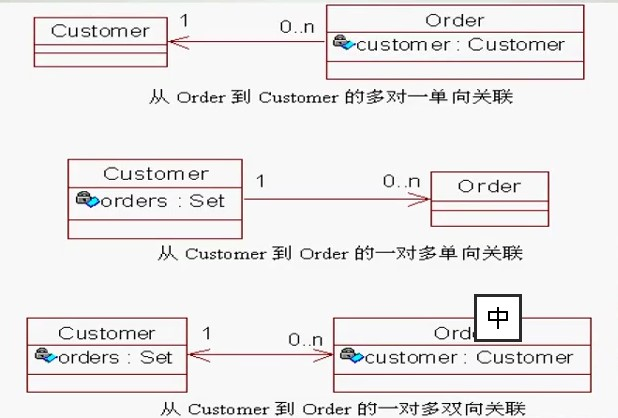
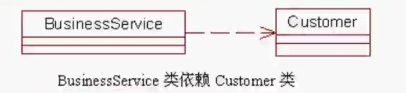
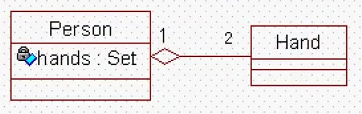
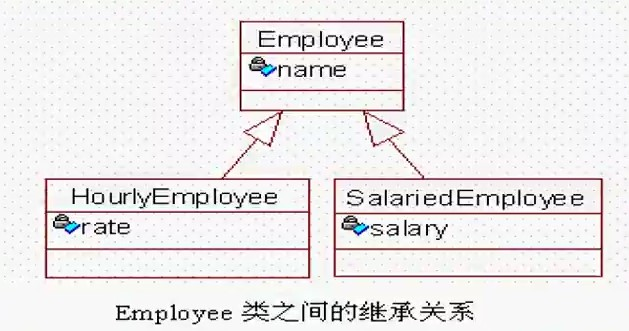
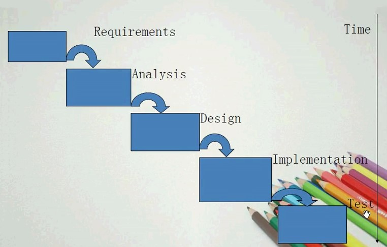
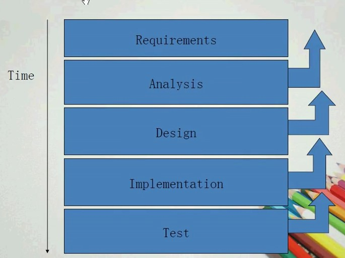

# UML

## OOAD

> Object Oriented Analysis and Deisgn 棉线对象分析与设计

- OOA：分析阶段
- OOD：设计阶段

### 定义OOA阶段

- 分析阶段主要解决一下问题
  - 建立针对业务问题域的清晰视图
  - 列出系统必须要完成的核心人物
  - 真对问题域见建立公共词汇表
  - 列出针对此问题域的最佳解决方案

- 此阶段要解决的核心问题是“What to do?”

### 定义 OOD 阶段

- 设计阶段主要解决一下问题
  - 如何解决具体的业务问题
  - 引入系统工作所需要的支持元素
  - 定义系统的实现策略
- 此阶段要解决的核心问题是“How to do?”

### OOP 的主要特征

- abstract
- encapsulation
- inheritance
- polymorphism
- association(关联)
- aggregation(聚合)
- composition(组合)
- cohension & coupling (内聚合耦合)

### 抽象

- 忽略掉一个对象或实体的细节而只关注其本质特征的过程
- 简化功能与格式
- 帮助用户与对象交互

### 封装

- 隐藏数据和实现
- 提供公共方法供用户调用功能
- 对象的两种视图
  - 外部视图：对象能做的工作
  - 内部视图：对象如何完成工作

### 继承

- 通过存在的类型定义新类型的机制
- 通常在两个类型之间存在“is a ” 或 "kind of" 这样的关系
- 通过继承可实现代码重用，另外继承也是多态的基础
- 如苹果“is a” 水果

### 多态

- 一个名称，多种形式
- 给予继承的多态
- 调用方法时根据所给对象的不同选择不同的处理方式
- football - play(); 使用脚来完成
- basketball - play() 使用手来完成
- 给出一个具体的足球或篮球，用户自动知道该使用谁的方式去执行play()

### association

- 对象之间交互时的一种引用方式
- 当一个对象通过对另一个对象的引用去使用另一个对象的服务或操作时，两个对象之间便产生了关联
- 如 person 使用computer, person与computer 之间就存在了关联关系

### aggregation

- 关联关系的一种，一个对象成为另外一个对象的组成部分
- 是一种关联较强的关联
- 在两个对象之间存在“has a”这样的关系，一个对象作为另一个对象的属性存在，在外部对象被生产时，可由客户端指定与与其关联的内部对象
- 如汽车与轮胎，轮胎作为汽车的一个组成部分，它和汽车可以分别生产以后装配起来使用，但汽车可以换新轮胎，轮胎也可以卸下来给其他汽车使用。

### composition

- 当一个对象包含另一个对象时，外部对象负责管理内部对象的生命周期的情况
- 关联关系中最为强烈的一种
- 内部对象的创建由外部对象自己控制
- 外部对象不存在时，内部对象也不能存在
- 如电视机与显示屏

### 域模型

- 是面向对象的。在面向对象术语中域模型也可称为设计模型。域模型由以下内容组成：
  - 具有状态和行为的域对象
  - 域对象之间的关系
    - 关联 Association
    - 依赖 Dependency
    - 聚合 Aggregation
    - 一般化（泛化）Generalization

### 关联关系

### 依赖关系

在 BusinessService 类中访问 Customer 类的方法，并且构造 Customer 类的实例

### 聚集关系

> 整体与部分之间的关系，在实体域对象之间很常见

Person类与 Hand类之间的聚集关系

### 一般化关系

> 类之间的继承关系

### 内聚与耦合

- 内聚：度量一个类独立完成某项工作的能力
- 耦合：度量系统内火系统之间依赖关系的复杂度
- 设计原则：增加内聚，较少耦合

## 开发过程

- 传统开发过程
  - 瀑布模型
  - 
- 统一软件开发过程（USDP）

### OOAD 的开发过程

- 大项目分解为一些子项目
- 使用UML工具
- 统一软件开发过程是一个迭代、递增的开发过程

### 迭代、递增的项目生命周期

- 项目是迭代、递增的
- 迭代指生命周期中的一个步骤
- 迭代导致“递增”或者是整个项目的增长
- 大项目分解为子项目

- 在每一个迭代的阶段，应该做一下工作
  - 选择并分析相关用例
  - 根据所选架构进行设计
  - 在组件层次实现设计
  - 验证组件满足用例的需要
- 当一次迭代满足目标后，开发进入下一个迭代周期

### 迭代、递增生命周期的主要阶段

- Inception-start up
- Elaboration - refine
- Construction - implement
- Transition - promotion

- 每一个周期包含一次货多次迭次
- 一个阶段的结束称之为“里程碑”(milestone)

### 初始化阶段

- 该阶段的增量集中于：
  - 项目启动
  - 建立业务模型
  - 定义业务问题域
  - 找出主要的风险因素
  - 定义项目需求的外延
  - 创建业务问题域的相关说明文档

### 细化阶段

- 本阶段的增量集中于：
  - 高层的分析与设计
  - 建立项目的基础框架
  - 监督主要的风险因素
  - 制定达成项目目标的创建计划

### 构建阶段

- 本阶段的增量集中于：
  - 代码及功能的实现

### 移交阶段

- 本阶段的增量集中于：
  - 向用户发布产品
  - beta 测试
  - 执行性能调优，用户培训和接受测试

### 每一个阶段所含工作流

- 每一次递增都由5部分工作流组成
  - 需求与初始分析
  - 分析
  - 设计
  - 实现
  - 测试
  - 每一次迭代执行工作流的深度不同
  - 早期的迭代在深度上覆盖初始工作流，后期迭代在深度上覆盖后期工作流
  - 88/20 原则

### 迭代工作流

### 迭代、递增生命周期的优势

- 降低成本
- 便于更好的维护项目进度
- 便于团队的写作开发
- 便于适应用户需求的动态变化

## UML Introduction

> Unified Modeling Language, 统一建模语言。图像化语言，可以帮助我们在OOAD过程中标元素、构建模块、分析过程并可通过文档说明系统中的重要细节

### UML图的分类

- 静态模型
  - 创建并记录一个系统的静态特征
  - 反应一个软件系统基础、固定的框架结构
  - 创建相关问题域主要元素的视图
  - 静态建模包括
    - 用例图(use case diagrams)
    - 类图(class diagrams)
    - 对象图(object diagrams)
    - 组建图(component diagrams)
    - 部署图(deployment diagrams)
- 动态模型
  - 动态建模用以展示系统的行为
  - 动态建模包括
    - 时序图(sequence diagrams)
    - 协作图(collaboration diagrams)
    - 状态图(state chart diagrams)
    - 活动图(activity diagrams)

- 其他UML元素
  - 包(package)
  - UML的扩展机制
    - 注释(comments)
    - 构造型(stereotypes)
    - 标记值(tagged values)
    - 限制(constraints)

## 核心UML图

### 用例图

> 展示系统额核心功能及其与其交互的用户

- 用户被称之为**活动者**(Actor)
- **用例**使用椭圆表示(活动可以做什么事情，用例就是动词)
- 为简化建模过程，用例图可标注优先级

- guest 和 admin都是 Actor
- add,update, query 都是用例

## 类图

- 表现类的特征
- 类图描述了多个类、接口的特征，以及对象之间的协作与交互
- 由一个胡哦多个矩形区域构成，内容包括：
  - 类型（类名）
  - 属性（可选）
  - 操作（可选）

—— 关联关系 Association
——> 直接关联关系 DirectAssociation
---> 依赖关系 Dependency

- 一般化关系
  - 一般化指的是类之间的**继承关系**
  